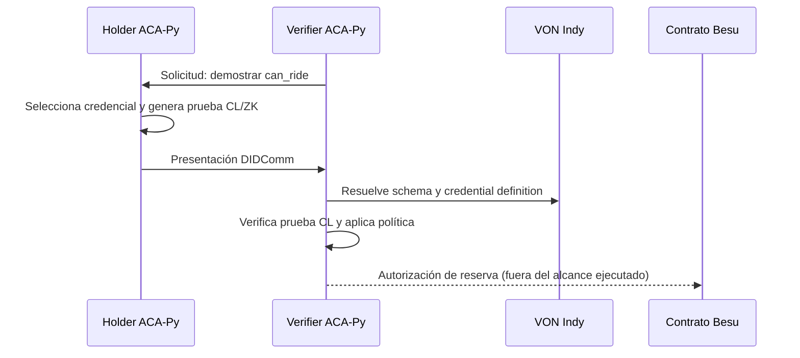
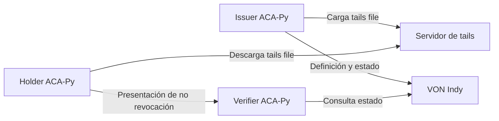

# Resultados iniciales: experimento B (AnonCreds CL/ZK)

## Alcance ejecutado

Se ejecutó el flujo completo de presentación AnonCreds con ACA-Py 1.2.0 sobre
la VON actual. El issuer y el holder usados para la medición son los servicios
aislados de `SSI_App/agents/case_b`; sus wallets y PostgreSQL no se comparten
con los agentes de la aplicación.

Objetos SSI empleados:

| Objeto | Identificador |
|---|---|
| Schema | `5rtvexuq6mGGkvikxen2qK:2:user_credential:2.0` |
| Credential definition CL | `5rtvexuq6mGGkvikxen2qK:3:CL:10:case-b` |
| Atributos | `nombres`, `apellidos`, `fecha_nacimiento`, `can_ride` |

Cada caso se ejecutó 30 veces. La fuente de datos por repetición está en
[`results.json`](../SSI_App/agents/case_b/results/20261004T165420Z/results.json)
y en formato tabular en
[`results.csv`](../SSI_App/agents/case_b/results/20261004T165420Z/results.csv).
El contexto de ejecución y los identificadores están en
[`metadata.json`](../SSI_App/agents/case_b/results/20261004T165420Z/metadata.json).

## Problema que evalúa esta alternativa

Una reserva de vuelo necesita decidir si el pasajero está autorizado. En el
flujo original, Django recibe o consulta información de la credencial, toma la
decisión y comunica el resultado a Besu. El contrato confía en ese resultado;
por ello Django cumple el papel de *Trusted Verifier*.

La alternativa AnonCreds CL/ZK conserva un verifier, pero cambia la evidencia
con la que este toma la decisión. En vez de aceptar una afirmación acerca de la
credencial, el verifier recibe una presentación criptográfica generada por el
holder. Esta acredita que un issuer reconocido emitió la credencial y permite
revelar solamente los atributos requeridos por la política.

El experimento no ejecuta aún la reserva en Besu. Mide el tramo SSI que debe
ocurrir antes de enviar una autorización al contrato: selección de la
credencial, construcción de la presentación, resolución de objetos públicos
en VON Indy y verificación criptográfica.



## Proceso ejecutado en una repetición válida

1. El verifier envía al holder una solicitud DIDComm que pide el atributo
   `can_ride` y restringe la prueba a la credential definition esperada.
2. El holder consulta sus credenciales locales y selecciona explícitamente la
   que cumple la solicitud.
3. El holder ejecuta `send-presentation`. ACA-Py crea una presentación
   AnonCreds basada en una firma CL y la transmite al verifier.
4. El verifier resuelve el schema y la credential definition publicados en la
   VON actual.
5. El verifier ejecuta `verify-presentation`, que valida la relación entre la
   prueba, la firma del issuer, la credential definition y la solicitud.
6. Solo después de una verificación criptográfica válida se aplica la política
   de negocio: una reserva se autoriza cuando el atributo revelado es
   `can_ride=true`.

Se registraron por repetición el tiempo de construcción en el holder, el tiempo
de verificación, tamaño de la presentación, atributos revelados, predicados,
tiempo de consulta de schema y credential definition, y dos instantáneas de
CPU/memoria para holder y verifier.

## Propósito de cada caso

| Caso | Ejecución | Pregunta que responde | Resultado esperado |
|---|---|---|---|
| B1 | Credencial con `can_ride=true`; revelar solo ese atributo | ¿Puede el holder probar autorización con divulgación mínima? | Prueba CL válida y reserva autorizada. |
| B2 | Credencial válida con `can_ride=false` | ¿La validez criptográfica equivale a autorización? | Prueba CL válida, pero política rechaza la reserva. |
| B3 | Credencial con `can_ride=true`; revelar solo ese atributo | ¿Quedan ocultos `nombres`, `apellidos` y `fecha_nacimiento`? | Prueba válida con los otros tres atributos sin revelar. |
| B4 | Alterar un elemento criptográfico de una prueba CL válida | ¿Una prueba modificada es detectada? | La verificación debe devolver falso. |
| B5 | Solicitar una credential definition incompatible | ¿La solicitud queda vinculada a la autoridad emisora esperada? | El holder no encuentra credencial candidata. |
| B6 | Solicitar un schema incompatible | ¿La solicitud queda vinculada al modelo de atributos esperado? | El holder no encuentra credencial candidata. |
| B7 | Revocar una credencial y pedir una prueba posterior | ¿Una credencial revocada impide reservar? | Rechazo por no revocación inválida. |
| B8 | Pedir prueba de no revocación de una credencial vigente | ¿Puede probarse vigencia sin revelar más atributos? | Prueba válida y reserva autorizada. |

## Resultados

| Caso | Resultado observado | Generación p50 / p95 (ms) | Verificación p50 / p95 (ms) | Tamaño p50 (bytes) |
|---|---|---:|---:|---:|
| B1: `can_ride=true` | 30/30 pruebas CL válidas; 30/30 autorizaciones | 31.503 / 52.180 | 27.722 / 30.323 | 4,877 |
| B2: `can_ride=false` | 30/30 pruebas CL válidas; 30/30 rechazos de política | 31.679 / 38.962 | 27.950 / 34.168 | 4,889 |
| B3: solo revelar `can_ride=true` | 30/30 pruebas CL válidas; 30/30 autorizaciones | 30.465 / 33.932 | 27.315 / 31.011 | 4,881.5 |
| B5: credential definition incompatible | 30/30 rechazos: el holder no encontró credencial candidata | — | — | — |
| B6: schema incompatible | 30/30 rechazos: el holder no encontró credencial candidata | — | — | — |

Los valores de generación miden el `send-presentation` del holder. Los de
verificación miden la invocación `verify-presentation` en el verifier. El
ejecutor también guarda tiempos de consulta del schema y de la credential
definition, tamaño de la presentación y dos instantáneas de CPU/memoria de
ambos agentes por fila.

## Interpretación correcta

La prueba CL acredita la procedencia e integridad de la credencial. La decisión
de reservar el vuelo sigue una etapa separada: con B2, la prueba fue válida,
pero el valor revelado `can_ride=false` produjo el rechazo. Esta separación es
necesaria al comparar AnonCreds con un trusted verifier: la verificación
criptográfica no sustituye por sí sola la política de autorización.

En B1 y B3 solo se revela `can_ride`; los atributos `nombres`, `apellidos` y
`fecha_nacimiento` permanecen ocultos. Con el schema actual, `can_ride` es el
texto `"true"` o `"false"`; por tanto, esta prueba no debe describirse como un
predicado ZK booleano que oculte el valor del permiso. Para evaluar ese
predicado se requeriría un atributo numérico y una política compatible, sin
cambiar el experimento ya ejecutado.

B5 y B6 son rechazos de selección de credencial antes de construir una prueba.
Muestran que la restricción de schema o credential definition evita presentar
una credencial que no corresponde a la solicitud. No se deben reportar como
fallos de la verificación criptográfica de una prueba ya recibida.

## Relación con el Trusted Verifier

| Propiedad | Trusted Verifier Django | AnonCreds CL/ZK evaluado |
|---|---|---|
| Evidencia de emisión | Lógica y datos que procesa el servidor | Presentación CL verificable contra objetos del ledger |
| Divulgación selectiva | No forma parte del flujo actual | Se reveló solo `can_ride` |
| Integridad de presentación | Confianza en la implementación del servidor | La prueba modificada deja de verificar |
| Política de reserva | Django decide | El verifier aún decide con el atributo revelado |
| Comunicación con Besu | Django/bridge | No implementada en este experimento |
| Punto de confianza operativo | Un servidor | El verifier sigue siendo componente operativo, aunque no inventa una prueba CL válida |

Por ello, esta alternativa reduce la confianza necesaria para validar la
credencial y mejora la privacidad del holder, pero no elimina por sí sola el
componente que traduce el resultado de autorización hacia Besu. Eliminarlo
requeriría que el contrato verificara una prueba compatible con EVM, o que un
mecanismo adicional y distribuido atestiguara el resultado hacia el contrato.

## B4: presentación criptográficamente modificada

Se realizó una comprobación de control con la biblioteca `anoncreds` de bajo
nivel. Se tomó una presentación real B1, se verificó con su schema y
credential definition, se modificó el componente `a_prime` de la prueba
primaria y se volvió a verificar.

```text
Presentación original  -> verify(...) = True
Presentación alterada  -> verify(...) = False
```

Este control valida el mecanismo que se medirá en B4. Para completar B4 según
el protocolo, se debe convertirlo en un harness que tome 30 presentaciones
independientes, altere una copia de cada una y guarde por repetición el tiempo
de verificación y el resultado. No debe inyectarse la prueba alterada mediante
la API Admin de ACA-Py: dicha API genera y entrega la presentación como una
sola operación y no expone un endpoint para enviar el artefacto ya manipulado.

## Configuración revocable para B7 y B8

La credential definition usada en B1--B6 fue creada sin soporte de revocación.
No se puede convertir posteriormente en revocable. B7 y B8 requieren una nueva
credential definition asociada al mismo schema `user_credential:2.0`.

La arquitectura necesaria es:



Los *tails files* son material criptográfico que permite al holder construir y
al verifier validar una prueba de no revocación. No contienen la credencial
completa ni sustituyen el estado de revocación publicado en el ledger.

### Cambios de infraestructura

1. Añadir al Compose un servicio de tails con una URL pública de lectura y una
   URL de carga para el issuer. Para entorno local puede exponerse, por ejemplo,
   en `http://localhost:6543`; en producción debe estar disponible para los
   participantes y limitar la carga al issuer autorizado.
2. Añadir al comando del servicio `issuer` las opciones ACA-Py equivalentes a:

   ```text
   --tails-server-base-url http://localhost:6543
   --tails-server-upload-url http://localhost:6543
   ```

3. Reiniciar solo el entorno aislado `case_b` con la configuración nueva. Se
   mantienen el schema actual y la VON actual; se crean objetos nuevos de
   credential definition y revocation registry.

### Preparación de los objetos SSI

1. Crear una credential definition nueva con el mismo `schema_id`, un tag
   distinto, por ejemplo `case-b-revocable`, y:

   ```json
   {
     "support_revocation": true
   }
   ```

2. Crear una revocation registry vinculada a esa credential definition. Fijar
   su capacidad antes de emitir, por ejemplo `max_cred_num=100`.
3. Publicar en VON Indy la definición de la registry y su estado inicial. El
   issuer genera y carga el tails file; la definición publicada referencia su
   ubicación y hash.
4. Emitir al menos dos credenciales revocables: una que se mantendrá vigente
   para B8 y otra que se revocará para B7. Guardar para cada una `rev_reg_id` y
   `cred_rev_id`.

### Ejecución de B8: no revocación válida

1. Solicitar `can_ride` junto con un intervalo de no revocación actual.
2. El holder obtiene el tails file y el estado vigente de la registry.
3. El holder genera una presentación que incluye la prueba de no revocación.
4. El verifier resuelve el estado publicado y valida la presentación.
5. Ejecutar 30 repeticiones y registrar, además de las métricas existentes,
   tiempo de consulta de revocación, tamaño de la prueba y resultado de
   verificación.

Resultado esperado: las 30 presentaciones deben verificar y autorizar la
reserva si `can_ride=true`.

### Ejecución de B7: credencial revocada

1. Revocar la segunda credencial mediante su pareja `rev_reg_id` y
   `cred_rev_id`.
2. Publicar el nuevo estado de la revocation registry en VON Indy.
3. Solicitar una presentación de no revocación con un intervalo posterior a la
   publicación de esa actualización.
4. El holder intenta generar la presentación; si la genera, el verifier debe
   rechazarla al contrastar el estado actual.
5. Repetir 30 veces y registrar si el rechazo ocurrió durante generación o
   verificación, junto con las métricas de revocación.

El instante solicitado es esencial. Una prueba puede acreditar que una
credencial era válida antes de ser revocada. B7 solo evalúa la revocación si el
verifier exige vigencia en un instante posterior al estado revocado publicado.

## Estado del experimento B

Los ocho casos del protocolo fueron completados. Los casos B1--B3 y B8 miden
presentaciones válidas; B4 mide integridad criptográfica; B5 y B6 miden
selección incompatible de credencial; y B7 mide rechazo de no revocación tras
publicar la revocación en VON Indy.

## Reproducción

## Actualización: B4, B7 y B8 completados

Los casos pendientes fueron ejecutados con 30 repeticiones cada uno. La tabla
de resultados completa queda así:

| Caso | Resultado | Generación p50 / p95 (ms) | Verificación p50 / p95 (ms) | Tamaño p50 (bytes) |
|---|---|---:|---:|---:|
| B4 | 30/30 pruebas originales válidas y 30/30 copias alteradas rechazadas | — | 14.159 / 15.497 | — |
| B7 | 30/30 presentaciones de credencial revocada rechazadas | 124.092 / 167.012 | 80.282 / 143.846 | 10,872.5 |
| B8 | 30/30 presentaciones vigentes con no revocación válidas | 97.057 / 169.220 | 75.878 / 144.882 | 10,876.5 |

Para B4, [`run_case_b4.py`](../SSI_App/agents/case_b/run_case_b4.py) tomó 30
presentaciones B1 reales, modificó `a_prime` en una copia de cada una y ejecutó
`anoncreds.Presentation.verify`. La prueba original verificó como verdadera y
la alterada como falsa en las 30 repeticiones. Sus artefactos están en
[`20261004T215517Z_b4`](../SSI_App/agents/case_b/results/20261004T215517Z_b4).

Para B7 y B8 se añadió el servicio `ti3-case-b-tails` al Compose aislado en
el puerto 6543 y se reinició el issuer con `--tails-server-base-url` y
`--tails-server-upload-url`. Se creó la credential definition revocable
`5rtvexuq6mGGkvikxen2qK:3:CL:10:case-b-revocable`, una registry de capacidad
100, se publicó su definición y estado inicial en VON Indy y se cargó el tails
file. Se emitieron dos credenciales revocables: índice `1` para B8 e índice
`2` para B7. La segunda fue revocada y su nuevo estado fue publicado antes de
ejecutar las pruebas B7.

[`run_case_b_revocation.py`](../SSI_App/agents/case_b/run_case_b_revocation.py)
solicita explícitamente no revocación hasta el instante actual. B8 usa la
credencial vigente; B7 usa la credencial revocada. Los datos completos están
en [`20261004T221344Z_b8`](../SSI_App/agents/case_b/results/20261004T221344Z_b8)
y [`20261004T221939Z_b7`](../SSI_App/agents/case_b/results/20261004T221939Z_b7).

```bash
cd SSI_App/agents/case_b
python3 run_case_b.py --runs 30 --cases B1,B2,B3,B5,B6
python3 run_case_b4.py --runs 30
python3 run_case_b_revocation.py --case B8 --role vigente --runs 30
python3 run_case_b_revocation.py --case B7 --role revocar --runs 30
```

El programa crea una nueva carpeta fechada por ejecución y no sobrescribe los
resultados existentes.
